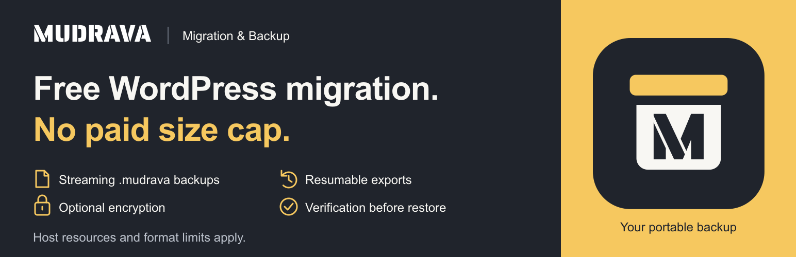
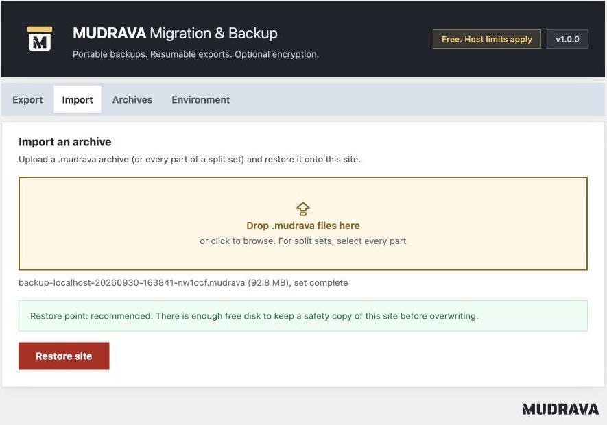

<p align="center">
  
</p>

# MUDRAVA Migration & Backup

Move a WordPress site to another host or domain. Keep a backup before a change.
Restore from your own portable `.mudrava` archive.

**The complete manual workflow is free. No account. No paid archive size cap.**
Host resources and format limits still apply.

[**Get the plugin on WordPress.org**](https://wordpress.org/plugins/mudrava-migration-backup/)
 · [Release notes and ZIP](https://github.com/Mudrava/MUDRAVA-Migration-Backup/releases/tag/v1.0.0)
 · [Report an issue](https://github.com/Mudrava/MUDRAVA-Migration-Backup/issues/new/choose)
 · [MUDRAVA](https://mudrava.com/en/)

> **Release status:** 1.0.0. WordPress.org approved the plugin on October 2, 2026.
> WordPress.org and the GitHub release provide the installable plugin. GitHub's automatic “Source code”
> archives contain the development repository.

## What you can do

| Feature | What it does |
| --- | --- |
| Export, import and restore | Move the database, media, themes, plugins and site files. |
| Streaming backups | Process files in chunks and database rows in batches. |
| Resumable jobs | Continue supported interrupted jobs from saved checkpoints. |
| Optional encryption | Protect an archive with a password and authenticated encryption. |
| Split archives and exclusions | Transfer a backup in parts and choose what to include. |
| Verification before restore | Check the archive and supported paths before replacing site data. |
| Destination restore point | Save the destination before overwriting and attempt recovery after an import error. |
| URL rewriting | Update site URLs, including recognized PHP serialized values. |

No telemetry or external migration service is used. WordPress handles its normal
plugin update checks. You store and transfer your own archives.

## Install and migrate

1. In WordPress, open **Plugins → Add Plugin** and search for **MUDRAVA Migration & Backup**.
2. Install and activate the plugin. You can also [download the ZIP from WordPress.org](https://wordpress.org/plugins/mudrava-migration-backup/) and use **Upload Plugin**.
3. Open **MUDRAVA → Environment** and review the host checks.
4. On the source site, open **Export**, choose your options and select **Create backup**.
5. Download the archive. Install the plugin on the destination and upload the archive under **Import**.
6. Review the restore point information, restore, then inspect pages, media, accounts and integrations.

**Requirements:** standalone WordPress 6.0+, 64 bit PHP 7.4+ and zlib.
Encrypted archives also require the backend recorded in the archive on the
destination, either libsodium or the supported OpenSSL fallback.

<p align="center">
  
</p>

[Export](wordpress-org/assets/screenshot-1.jpg)
 · [Encryption and archive options](wordpress-org/assets/screenshot-3.jpg)
 · [Environment checks](wordpress-org/assets/screenshot-4.jpg)
 · [Local archives](wordpress-org/assets/screenshot-5.jpg)

## Tested, with clear limits

| Check | Recorded result |
| --- | --- |
| Automated suite | 580 tests and 2,625 assertions passed on October 2, 2026. |
| Code checks | PHPCS, PHPStan and distribution validation passed. |
| WordPress Plugin Check | No findings for the review candidate on the PHP 7.4 test site. |
| Large file round trip | A real 100 GiB file was exported and restored with matching independent hashes. |
| Plugin fixtures | Focused Elementor, Advanced Custom Fields and Polylang migration scenarios passed. |

See the [100 GiB report](docs/benchmark-100-gib.md),
[compatibility scope](docs/compatibility.md) and
[release validation](docs/free-release-candidate-2026-09-30.md).
These results do not guarantee every host, plugin configuration or workload.

Pause orders, submissions, uploads and background writers during the final
export. This release does not create a snapshot from one point in time of a
changing site. Keep the import page open until restoration completes.

Multisite is not supported. Private archives need durable storage outside the
web root. The Environment screen warns when temporary storage is being used.
The earlier closed MUDRAVA plugin used a different format; its archives are not
assumed compatible with this public release.

## Help and documentation

- [WordPress.org plugin page](https://wordpress.org/plugins/mudrava-migration-backup/) and [support forum](https://wordpress.org/support/plugin/mudrava-migration-backup/)
- [Compatibility](docs/compatibility.md), [shared hosting](docs/shared-hosting.md) and [large sites](docs/large-sites.md)
- [Recovery guide](docs/recovery.md) and [privacy](docs/privacy.md)
- [Security policy](SECURITY.md) for private vulnerability reports
- [Issue templates](https://github.com/Mudrava/MUDRAVA-Migration-Backup/issues/new/choose) for bugs and migration problems

Never attach a site backup, password, restore token or database dump to a public issue.

## For developers

```bash
composer install
npm ci
composer check
composer dist
```

`composer dist` produces the installable ZIP in `dist/`.
For a Docker lab and browser tests, see [development](docs/development.md) and
[testing](docs/testing.md). CI workflows currently run manually.

Read the [architecture](docs/architecture.md), [archive format](docs/mudrava-format.md),
[contribution guide](CONTRIBUTING.md) and [release process](docs/release.md).

## License

[GPL 2.0 or later](LICENSE). Published by [MUDRAVA](https://mudrava.com/en/).
