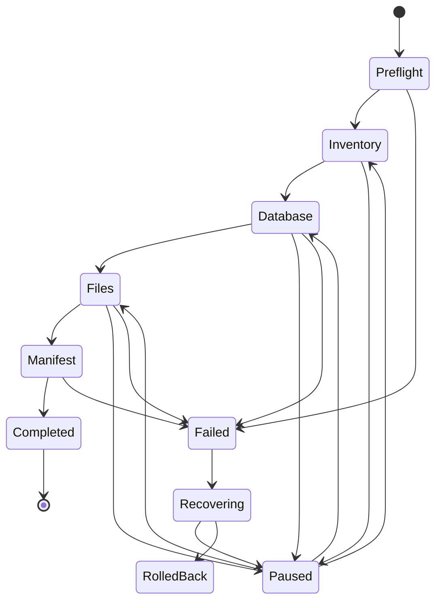

# Architecture - MUDRAVA Migration & Backup

## Принцип

Никакого «собрать весь ZIP во временную директорию, потом отдать». `.mudrava` -
**append-only framed streaming container** (см. `mudrava-format.md`).

Для 2 TB:

```text
read 16–64 MB → compress → encrypt → write → release memory → next block
```

а не `2 TB → temp dir → giant ZIP → copy ZIP → PHP dies`.

**Bounded-memory contract:** размер сайта практически не влияет на peak RAM.

## Слои

```text
Admin UI (React-ish vanilla, accessible)
   │  REST (namespaced, permission callbacks, nonces)
   ▼
Job Runner  ── durable state machine, короткие idempotent jobs
   │
   ├── Archive/   FrameReader, FrameWriter, Manifest, Splitter
   ├── Crypto/    KeyDerivation, FrameCipher (sodium primary / openssl fallback)
   ├── Compression/ DeflateCodec
   ├── Database/  TableStream (export), TableRestore, UrlRewriter (serialized-safe)
   ├── Filesystem/ Inventory, PathGuard, FileStreamer
   ├── Transport/ ChunkUpload, ChunkDownload
   ├── Storage/   BackupSink / BackupSource interfaces
   ├── Rollback/  RestorePoint
   └── Support/   Logger (redaction), Diagnostics, ErrorCodes
```

## State machine



Каждый step: short-running, idempotent где возможно, checkpointed, retryable,
observable, bounded in memory, безопасен против дубль-запросов. Это важнее
борьбы с `max_execution_time` через `set_time_limit(0)` (на shared hosting
бесполезен/запрещён).

## Runner

WP-Cron + browser-driven tick. Если cron недоступен (типичный shared host),
браузер/REST runner продолжает двигать job. Job-очередь в option/transient с
lock (авто-протухание), чтобы параллельные запросы не удваивали работу.

REST-эндпоинты двигают job на один «батч» за запрос и возвращают состояние +
процент + throughput. UI опрашивает статус и resume с durable offset.

## 64-bit offsets

Все файловые/архивные офсеты - `int` на 64-bit PHP. Preflight **падает**, если
`PHP_INT_MAX < 2^40` (32-bit runtime) - безопасная миграция больших сайтов
невозможна. Через JSON/API офсеты уходят **десятичными строками**.

## Storage abstraction

```php
interface BackupSink {
    public function open(string $archiveId): void;
    public function append(string $bytes): void;
    public function checkpoint(Checkpoint $cp): void;
    public function finalize(Manifest $m): void;
}
interface BackupSource {
    public function seekToCheckpoint(string $cpId): void;
    public function read(int $maxBytes): string;
    public function eof(): bool;
}
```

Free: `LocalFileSink`, `BrowserDownloadSink`, `BrowserUploadSource`.
Pro (add-on): `S3Sink`, `S3CompatibleSink`, `SftpSink`, `DirectPeerSink`.
Reader один и тот же для local / split-set / HTTP body / browser upload -
из-за forward-only парсера.

## База данных

Не один монолитный `.sql`. Стрим `TABLE_BEGIN → SCHEMA → ROW_BATCH* → TABLE_END`
(см. формат §7). Даёт: ограниченный RAM, resume на границах батчей, корректный
BLOB, adaptive inserts, диагностику по таблице, точечный URL-replace.

URL replacement - WordPress-aware: понимает serialized arrays/objects (чинит
`s:N:` длины корректно), JSON, plain strings; НЕ трогает binary blobs вслепую.

## Файловая система

`PathGuard` отвергает `../`, absolute, Windows-drive, null bytes, symlink
наружу. Symlinks по умолчанию не восстанавливаются. Никогда не пишем за
пределы destination root.

## Rollback

Перед разрушительным restore - preflight (PHP, integer width, DB, permissions,
free/temp disk, integrity metadata, crypto capability, размер текущего сайта,
rollback headroom). Safe mode создаёт restore point, если диск позволяет.
Нельзя обещать rollback, когда место физически не даёт сохранить старое
состояние. Low-disk режим - под Advanced с явным high-risk warning.

## Наблюдаемость

Каждый job: operation UUID, state, checkpoint, logical/physical bytes, текущий
ресурс/таблица, throughput, retry count, started_at, updated_at, стабильный
error code. USER MESSAGE отделён от DEVELOPER DIAGNOSTICS.

```text
User:  "Migration paused because the destination disk is full."
Dev:   MUDRAVA_DISK_FULL stage=file_restore frame=192839
       required_bytes=... available_bytes=...
```

Telemetry - opt-in (WP.org). Не шлём домены/имена/данные без consent.

## Безопасность (high privilege)

Capability checks + REST permission callbacks + nonces + CSRF + sanitization +
escaping + `$wpdb->prepare` + path validation + SSRF-защита (deny private
ranges для remote) + archive traversal defenses + replay protection +
pairing token expiry + constant-time сравнение секретов + rate limiting +
redaction логов + least-privilege FS.

Никогда не логируем: пароли архива, browser tokens, cookies, Authorization,
DB passwords, WP salts, AWS/SFTP/license секреты.

## Free vs Pro в коде

Free НЕ содержит premium-код и не «разблокируется» оплатой (WP.org trialware
запрещён). Pro - отдельный GPL-совместимый add-on вне directory, расширяющий
Free через well-defined hooks/interfaces (`BackupSink`, `CommerceProvider`,
transport providers). Free репозиторий = GitHub (dev) + WP.org SVN (релизы).
